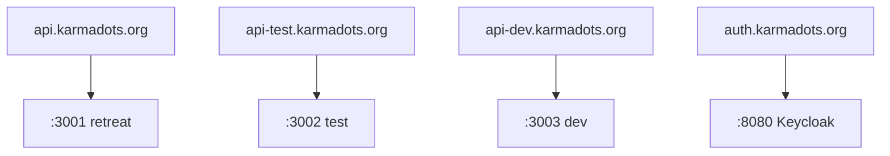
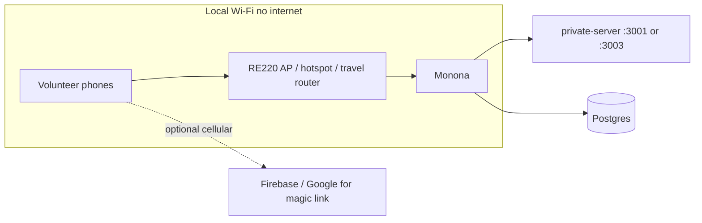

# KarmaDots / Jewel Heart — Infrastructure Overview

**Date:** 2026-07-19  
**Canonical path:** `JewelHeartAdminFunction/docs/INFRASTRUCTURE_OVERVIEW.md`  
**Audience:** Kevin (admin / Cursor workstation) and anyone operating the retreat stack.

This document explains how machines, Cloudflare, private-server environments, Postgres, the volunteer web app, the public marketing site, and repos fit together. **No secrets or tokens are included.**

---

## 1. Machines

| Role | What it is | How you reach it |
|------|------------|------------------|
| **Admin / Cursor workstation** | **Mendota** — day-to-day development, Cursor, SSH client; also **offline retreat standby** (local Postgres + private-server clone; see §10) | Local / LAN `192.168.1.166` (confirm with `ipconfig getifaddr en0`) |
| **Server laptop** | **Monona** — Intel Mac that runs the production-ish stack + Cloudflare tunnel | Same LAN: `ssh monona` → `192.168.1.138`; remote: `ssh monona-ts` → Tailscale `100.97.171.97` |

### Monona (server laptop) details

| Field | Value |
|-------|--------|
| SSH config host (LAN) | `monona` (alias `laptop` for backward compatibility) → `192.168.1.138` |
| SSH config host (Tailscale) | `monona-ts` → `100.97.171.97` (MagicDNS: `kevins-macbook-pro-2.tail765fc1.ts.net`) |
| LAN IP | `192.168.1.138` |
| Tailscale IP | `100.97.171.97` |
| Hostname | `Monona.local` (ComputerName / LocalHostName: Monona) |
| Arch | Intel `x86_64` (`darwin_amd64`) |
| Runs | Homebrew Postgres@16, `private-server` (+ `-test` / `-dev`), `cloudflared` named tunnel `karmadots`, Keycloak (typically Docker on `:8080`), related LaunchAgents |

### Same-LAN requirement for SSH

`192.168.1.138` is a **private LAN address**. `ssh monona` (or `ssh laptop`) only works when Mendota is on the **same local network** as Monona. For remote admin when both machines are on the tailnet, use **`ssh monona-ts`** (Tailscale IP `100.97.171.97`). It is **not** a public SSH endpoint.

Public website/API access does **not** require LAN membership — that goes through Cloudflare (see below).

| Goal | Need same LAN? |
|------|----------------|
| `ssh monona` / Postgres SSH tunnel via LAN | **Yes** |
| `ssh monona-ts` (Tailscale) | **No** (both nodes online on tailnet) |
| Browse `https://api-*.karmadots.org/...` | **No** (any internet) |
| Offline retreat guests on local Wi‑Fi | Guests need **your** retreat Wi‑Fi; Mendota only if you want SSH |

Optional admin helper: from JewelHeartAdminFunction, `scripts/karmadots-laptop-postgres-tunnel.sh` forwards local `:5433` → Monona `127.0.0.1:5432` over SSH so Mendota can run tools against Monona Postgres.

---

## 2. Cloudflare

Public HTTPS for APIs and Keycloak is provided by a **named Cloudflare Tunnel** running **on Monona**.

| Item | Value |
|------|--------|
| Tunnel name | `karmadots` |
| Connector host | Monona (`cloudflared`) |
| Config (mirror in repo) | `JewelHeartAdminFunction/scripts/deploy/cloudflared-config.yml` |
| Live config on Monona | `~/.cloudflared/config.yml` |

### Host → origin map

| Public hostname | Local origin on Monona |
|-----------------|------------------------|
| `api.karmadots.org` | `http://127.0.0.1:3001` (retreat / prod private-server) |
| `api-test.karmadots.org` | `http://127.0.0.1:3002` (test) |
| `api-dev.karmadots.org` | `http://127.0.0.1:3003` (dev) |
| `auth.karmadots.org` | `http://127.0.0.1:8080` (Keycloak) |

DNS for these names is CNAME’d (proxied) to the tunnel’s `*.cfargotunnel.com` target in the Cloudflare zone for `karmadots.org` (confirmed in the zone export below).

### DNS records (karmadots.org)

Export: `karmadots.org-2.txt` (2026-07-19). Nameservers: `paloma.ns.cloudflare.com`, `plato.ns.cloudflare.com`. Proxy = Cloudflare orange-cloud when true. TTL `1` in the export means Cloudflare automatic TTL.

**Apex / website**

| Type | Name | Content | Proxy | TTL |
|------|------|---------|-------|-----|
| A | `karmadots.org` | `185.199.108.153` | proxied | auto |
| A | `karmadots.org` | `185.199.109.153` | proxied | auto |
| A | `karmadots.org` | `185.199.110.153` | proxied | auto |
| A | `karmadots.org` | `185.199.111.153` | proxied | auto |
| CNAME | `www` | `bunkcorp.github.io` | proxied | auto |

**Tunnel / API / auth** (all → same tunnel UUID)

| Type | Name | Content | Proxy | TTL |
|------|------|---------|-------|-----|
| CNAME | `api` | `9a27f40c-dafb-451b-83d4-5f54ea1a718f.cfargotunnel.com` | proxied | auto |
| CNAME | `api-dev` | `9a27f40c-dafb-451b-83d4-5f54ea1a718f.cfargotunnel.com` | proxied | auto |
| CNAME | `api-test` | `9a27f40c-dafb-451b-83d4-5f54ea1a718f.cfargotunnel.com` | proxied | auto |
| CNAME | `auth` | `9a27f40c-dafb-451b-83d4-5f54ea1a718f.cfargotunnel.com` | proxied | auto |

**Email (Namecheap Private Email)**

| Type | Name | Content | Proxy | TTL |
|------|------|---------|-------|-----|
| MX | `karmadots.org` | `mx1.privateemail.com` (prio 10) | — | auto |
| MX | `karmadots.org` | `mx2.privateemail.com` (prio 10) | — | auto |
| CNAME | `mail` | `privateemail.com` | proxied | auto |
| CNAME | `autoconfig` | `privateemail.com` | proxied | auto |
| CNAME | `autodiscover` | `privateemail.com` | proxied | auto |
| SRV | `_autodiscover._tcp` | `0 0 443 privateemail.com` | — | auto |

**Firebase / login**

| Type | Name | Content | Proxy | TTL |
|------|------|---------|-------|-----|
| CNAME | `login` | `gettingstoned-4aee3.web.app` | DNS only | auto |
| CNAME | `firebase1._domainkey` | `mail-karmadots-org.dkim1._domainkey.firebasemail.com` | DNS only | auto |
| CNAME | `firebase2._domainkey` | `mail-karmadots-org.dkim2._domainkey.firebasemail.com` | DNS only | auto |
| TXT | `karmadots.org` | `firebase=gettingstoned-4aee3` | — | auto |
| TXT | `karmadots.org` | SPF: `include:spf.privateemail.com` + `include:_spf.firebasemail.com` `~all` | — | auto |
| TXT | `default._domainkey` | DKIM1 RSA public key (Private Email) | — | auto |

Also present: SOA (Cloudflare). **24** zone records total in the export (1 SOA + 2 NS + 4 A + 11 CNAME + 2 MX + 1 SRV + 3 TXT).

### LaunchAgents (Monona)

Tunnel reliability is managed with LaunchAgents under `~/Library/LaunchAgents/`, installed/refreshed via scripts such as `JewelHeartAdminFunction/scripts/deploy-karmadots-launchagents.sh`:

| Label | Purpose |
|-------|---------|
| `org.karmadots.cloudflare-tunnel` | Runs `cloudflared tunnel run karmadots` (via `run-tunnel-with-launchd.sh`) |
| `org.karmadots.tunnel-watchdog` | Restarts / heals the tunnel if it dies |
| `org.karmadots.mac-stay-awake` | Keeps Monona from sleeping so the tunnel stays up |

Without internet on Monona, Cloudflare hostnames are unreachable. Offline retreat uses LAN IP + port instead (see §8–§9).

---

## 3. Private servers & databases

Three **separate** Node (`private-server`) trees on Monona, each with its own port, DB name, and LaunchAgent. Deploy/promote tooling lives in `JewelHeartAdminFunction/scripts/deploy/jh-deploy.sh` (runs **on** Monona).

| Env alias | Directory on Monona | Port | Database | LaunchAgent label |
|-----------|---------------------|------|----------|-------------------|
| **retreat** / prod | `~/private-server` | **3001** | `karmadots` | `org.karmadots.private-server` |
| **test** | `~/private-server-test` | **3002** | `karmadots_test` | `org.karmadots.private-server-test` |
| **dev** | `~/private-server-dev` | **3003** | `karmadots_dev` | `org.karmadots.private-server-dev` |

### Postgres

| Item | Value |
|------|--------|
| Install | Homebrew **postgresql@16** |
| Bind | `127.0.0.1:5432` (local to Monona; not exposed publicly) |
| Tools path (typical) | `/usr/local/opt/postgresql@16/bin/psql` (Intel Homebrew) |
| Databases | `karmadots`, `karmadots_dev`, `karmadots_test` |

Each env’s `.env` sets `PORT` + `DATABASE_URL`. Promotion copies **code** between trees; each env keeps its own `.env` and data.

### Keycloak

`auth.karmadots.org` → Monona `:8080`. Used for some login paths (e.g. older/tester Keycloak flows). The **volunteer SPA at `/dev/` and `/test/` uses Firebase Auth**, not Keycloak, for day-to-day volunteer sign-in (see §4).

---

## 4. Volunteer web

Volunteer UI is **static HTML/JS served by Express** from the matching private-server, plus JSON APIs under `/jewelheart`.

| URL | Serves from | Typical use |
|-----|-------------|-------------|
| https://api-dev.karmadots.org/dev/ | private-server-dev `:3003` | Development / staging volunteer app |
| https://api-test.karmadots.org/test/ | private-server-test `:3002` | Tester volunteer app |
| (retreat paths / api.karmadots.org) | private-server `:3001` | Retreat / prod volunteer surface |

### Auth model (volunteer SPA)

- **Firebase Auth** (project `gettingstoned-4aee3`) — magic link / email flows, ID tokens sent as Bearer to the API.
- **Retreat LAN PIN** (optional, Mendota offline) — when `RETREAT_LAN_PIN` is set, `POST /auth/retreat-lan` issues a local Bearer JWT the SPA stores and sends like Firebase; Google/Email remain. See §10.
- **Not Keycloak** for the main volunteer SPA (legacy Keycloak session helpers may still clear old storage).
- API ACL on the server validates Firebase UIDs / tokens (or retreat-LAN JWTs) against Postgres volunteer records.

### Hardcoded API origins caveat

The volunteer bundle (`scripts/_volunteer-app.html` and deployed copies) maps environments to fixed HTTPS origins:

```text
dev     → https://api-dev.karmadots.org
test    → https://api-test.karmadots.org
retreat → https://api.karmadots.org
```

Env is detected from path (`/dev/`, `/test/`, `/retreat/`) or hostname. That means:

- Online: works as designed through Cloudflare.
- **Offline LAN:** opening `http://192.168.1.138:3003/dev/` may still try to call `https://api-dev.karmadots.org/...` unless the build is patched for same-origin / LAN origin. `jh-deploy.sh patch-web` normalizes some login pages toward same-origin when hostname starts with `api`; offline IP hosts need a deliberate patch or local DNS that matches those hostnames.

Firebase magic links also often use an authorized domain such as `karmadots.org` (not `api-*`), so email login may still need **cellular or some path to Google/Firebase** even on a captive retreat LAN.

Source / deploy: JewelHeartAdminFunction volunteer assets + `integrations/private-server/*` synced into the Monona `~/private-server*` trees.

---

## 5. karmadots.org website / GitHub Pages

| Item | Value |
|------|--------|
| Public site | https://karmadots.org |
| Repo | `bunkcorp/buddhist-stone-ios-app` |
| Branch (Pages) | `working-branch` |
| Published folder | `/docs` (GitHub Pages) |
| Local clones | `~/Desktop/buddhist-stone-ios-app`, `~/Desktop/buddhist-stone-app` (same repo family) |

### Marketing site vs API

| Surface | Hosted where | Role |
|---------|--------------|------|
| **Marketing / content** | GitHub Pages (`docs/`) | Landing, meditation pages, pitch, some tester entrypoints |
| **Volunteer API + SPA** | Cloudflare → Monona private-server | Live data, SDUI, scheduling |
| **Auth (Keycloak)** | Cloudflare → Monona `:8080` | Realm login when used |

Example Pages content: **`/meditation/`** → static site under `docs/meditation/` (e.g. on the Pages clone). That path does **not** run on private-server.

Some Pages HTML (e.g. `docs/testerslogin/`) may call `api-test.karmadots.org` or Keycloak; those still depend on Monona + tunnel being up.

**Do not** publish large internal ops docs into the Pages clone’s `docs/` unless intentional — that folder is the public site. Canonical infra docs live in **JewelHeartAdminFunction** (this file).

---

## 6. Repositories

| Repo | GitHub | Local paths | Owns |
|------|--------|-------------|------|
| **App + Pages** | `bunkcorp/buddhist-stone-ios-app` | `Desktop/buddhist-stone-ios-app`, `Desktop/buddhist-stone-app` | iOS/Android KarmaDots app, GitHub Pages marketing (`docs/`), some historical ops markdown |
| **Admin / deploy** | `bunkcorp/JewelHeartAdminFunction` | `Desktop/JewelHeartAdminFunction` | Jewel Heart admin, SDUI/volunteer integrations, `jh-deploy`, cloudflared config mirror, LaunchAgent examples, volunteer deploy scripts |

Runtime code on Monona lives in **`~/private-server*`** (not necessarily a git checkout of the app repo). JewelHeartAdminFunction is the control plane for patching and promoting into those directories.

---

## 7. Tailscale

| Status | Notes |
|--------|--------|
| **Not used** for KarmaDots guest/API path | Guests and APIs use **Cloudflare**; Tailscale is for **remote admin SSH** |
| Remote SSH | From Mendota: `ssh monona-ts` → Monona `100.97.171.97` (keep `ssh monona` for same-LAN) |
| Inventory | Personal tailnet `tail765fc1` (devices below) |

You do **not** need Tailscale for:

- Public `api*.karmadots.org` / `auth.karmadots.org`
- Offline retreat LAN (phones → your Wi‑Fi → Monona IP)

**How to connect remotely:** with Tailscale up on both machines, `ssh monona-ts` (HostName `100.97.171.97`). Prefer the Tailscale IP in SSH config — MagicDNS may not resolve on macOS Homebrew installs even when the peer is reachable.

### Tailscale devices

Export: `kevinalexwoods@gmail.com-devices-2026-07-19T12-11-14-323Z.csv` (tailnet `tail765fc1`). Live status checked 2026-07-19 after bringing Mendota online.

| Hostname (Tailscale) | Likely role | OS | Tailscale IPs | Notes | Managed by |
|----------------------|-------------|-----|---------------|-------|------------|
| `mendota` | **Mendota** (admin / Cursor; current) | macOS | `100.86.205.32`, `fd7a:115c:a1e0::8137:cd21` | Online after `sudo brew services start tailscale` + login | kevinalexwoods@gmail.com |
| `kevins-macbook-pro-local` | Mendota (prior node) | macOS | `100.120.224.17`, `fd7a:115c:a1e0::1f37:e011` | Offline after re-login as `mendota` | kevinalexwoods@gmail.com |
| `kevins-macbook-pro-2` | **Monona** (server laptop) | macOS | `100.97.171.97`, `fd7a:115c:a1e0::a737:ab61` | Online; SSH `monona-ts` | kevinalexwoods@gmail.com |
| `manasarovar` | Windows peer | Windows | `100.96.90.81`, `fd7a:115c:a1e0::e937:5a52` | — | djlewis@triadic.com |
| `namtso` | Windows peer | Windows | `100.120.172.85`, `fd7a:115c:a1e0::c937:ac56` | — | djlewis@triadic.com |

MagicDNS names follow `{hostname}.tail765fc1.ts.net` (e.g. `mendota.tail765fc1.ts.net`, `kevins-macbook-pro-2.tail765fc1.ts.net`).

---

## 8. Mermaid diagrams

### Online path (internet available)

```mermaid
flowchart LR
  subgraph clients [Clients]
    Phone[Phones / browsers]
    AdminMac[Mendota / Cursor]
  end

  subgraph cloudflare [Cloudflare]
    Edge[Edge + DNS karmadots.org]
    Tunnel[Named tunnel karmadots]
  end

  subgraph monona [Monona 192.168.1.138]
    CF[cloudflared]
    PS1[private-server :3001]
    PS2[private-server-test :3002]
    PS3[private-server-dev :3003]
    KC[Keycloak :8080]
    PG[(Postgres@16 :5432)]
  end

  subgraph pages [GitHub Pages]
    Site[karmadots.org /docs]
  end

  Phone --> Edge
  Edge --> Tunnel
  Tunnel --> CF
  CF --> PS1
  CF --> PS2
  CF --> PS3
  CF --> KC
  PS1 --> PG
  PS2 --> PG
  PS3 --> PG
  Phone --> Site
  AdminMac -->|SSH same LAN| monona
  AdminMac -->|HTTPS| Edge
```

Hostname routing inside the tunnel:



### Offline retreat minimum

No Cloudflare, no Tailscale, no admin Mac required for guests:



Guests open something like `http://192.168.1.138:3001/...` or `:3003/dev/` (after fixing API origin / same-origin if needed). Keep cellular available if Firebase email login is required.

---

## 9. What can be dropped for an offline retreat

### Must keep (minimum)

| Piece | Why |
|-------|-----|
| **Monona *or* Mendota standby** | Runs API + static volunteer UI — prefer **Mendota §10** if bringing only one Mac offline |
| **Postgres@16** + chosen DB (`karmadots` / `karmadots_dev` / `karmadots_test`) | All volunteer/schedule data |
| **One private-server** (usually retreat `:3001` or **dev `:3003`**) | Express + `/jewelheart` |
| **Local Wi‑Fi** (RE220 in AP mode, travel router, or carefully sized Mac hotspot) | Phones reach the chosen host |
| **Power / stay-awake** | Host must not sleep mid-session |

### Can drop / ignore

| Piece | Why safe to drop offline |
|-------|---------------------------|
| **Cloudflare / cloudflared / tunnel LaunchAgents** | Public DNS won’t resolve usefully without internet; guests use LAN IP |
| **Tailscale** | Not on the KarmaDots path |
| **Mendota / SSH** | Only needed for remote admin; operate on the Monona console if present |
| **GitHub Pages / karmadots.org marketing** | Static promo site; not the volunteer runtime |
| **api-dev / api-test extras** | Run **one** env only for the retreat |
| **Keycloak** | Not required if volunteer SPA uses Firebase only — **unless** you still depend on a Keycloak login page |
| **Second/third private-server trees** | Idle envs can stay stopped to save RAM |

### Still watch carefully

| Piece | Caveat |
|-------|--------|
| **Firebase Auth** | Magic link / Google may need **phone cellular** even if Wi‑Fi has no internet |
| **Hardcoded `api-*.karmadots.org` origins** | Patch for same-origin or local hostname before relying on `http://LAN-IP:...` |
| **Internet Sharing direction** | For phones joining **your** Wi‑Fi, don’t leave sharing in a mode that fights AP/Ethernet setup |

---

## 10. Mendota offline standby clone (retreat bring-only-Mendota)

**Created:** 2026-07-19 (ahead of Jewel Heart retreat).  
**Purpose:** Full local clone of Monona’s KarmaDots DB + private-server stack on **Mendota**, so the retreat can run on LAN with poor/no venue internet **without** bringing Monona and **without** starting a second Cloudflare tunnel.

### What lives on Mendota

| Piece | Status on Mendota |
|-------|-------------------|
| Homebrew **postgresql@16** | Installed; `brew services` / LaunchAgent `homebrew.mxcl.postgresql@16`; listens `:5432` |
| Roles | `kevinwoods` (superuser), `postgres` (superuser) — matches Monona |
| Databases | `karmadots`, `karmadots_dev`, `karmadots_test` restored from Monona `pg_dump -Fc` (2026-07-19) |
| Dump archive | `~/Desktop/karmadots-mendota-clone/dumps/*.dump` |
| private-server trees | `~/private-server` (:3001 → `karmadots`), `~/private-server-test` (:3002 → `karmadots_test`), `~/private-server-dev` (:3003 → `karmadots_dev`) — rsynced from Monona including `.env` + Firebase service account JSON |
| LaunchAgents | `org.karmadots.private-server{,-test,-dev}` installed (KeepAlive) |
| Cloudflare tunnel | **Must stay off on Mendota.** Tunnel LaunchAgent plists renamed to `*.plist.disabled-mendota-standby` so they cannot fight Monona’s live `karmadots` tunnel |
| Keycloak | **Not cloned** (Monona runs Keycloak via Docker Desktop on `:8080`). Volunteer SPA primary auth is **Firebase**, not Keycloak |

### Verified restore counts (2026-07-19)

| Database | Public tables | `jewelheart_volunteers` |
|----------|---------------|-------------------------|
| `karmadots` | 27 | 2 |
| `karmadots_dev` | 32 | 100 |
| `karmadots_test` | 32 | 101 |

Counts matched Monona at clone time.

### How to start / stop private-server (Mendota)

Preferred (LaunchAgents):

```bash
# Start / restart one env
launchctl kickstart -k "gui/$(id -u)/org.karmadots.private-server"       # :3001 retreat/prod
launchctl kickstart -k "gui/$(id -u)/org.karmadots.private-server-test"  # :3002
launchctl kickstart -k "gui/$(id -u)/org.karmadots.private-server-dev"   # :3003

# Stop one env
launchctl bootout "gui/$(id -u)/org.karmadots.private-server-dev"

# Status
launchctl list | grep karmadots
lsof -nP -iTCP:3001,3002,3003 -sTCP:LISTEN
```

Manual (from the tree so `dotenv` loads `.env`):

```bash
cd ~/private-server-dev && npm start          # PORT=3003
cd ~/private-server-test && npm start         # PORT=3002
cd ~/private-server && npm start              # PORT=3001
```

Wrapper used by LaunchAgents: `~/private-server*/scripts/run-with-launchd.sh` (resolves NVM node, clears stale listeners).

### LAN URLs (Mendota)

Confirm Mendota Wi‑Fi IP each venue (`ipconfig getifaddr en0`). Home LAN at clone time: **`192.168.1.166`**.

| Env | Health | Volunteer UI (preferred offline) |
|-----|--------|----------------------------------|
| retreat / prod | `http://<MENDOTA-IP>:3001/health` | `http://<MENDOTA-IP>:3001/login/` (prod tree has `public/login` only; `/retreat/` is not a static SPA on this tree) |
| test | `http://<MENDOTA-IP>:3002/health` | `http://<MENDOTA-IP>:3002/test/` |
| **dev (recommended offline)** | `http://<MENDOTA-IP>:3003/health` | `http://<MENDOTA-IP>:3003/dev/` |

JewelHeart API health: `http://<MENDOTA-IP>:3003/jewelheart/health`.

Mendota `.env` `JEWELHEART_PUBLIC_ORIGIN` values were pointed at `http://192.168.1.166:<port>` (backups: `~/private-server*/.env.bak-monona-clone-20260719`). Secrets stay in those `.env` files — **do not paste them into docs**. Update the IP in `.env` if Mendota gets a different address at the venue.

### Cloudflare / Monona relationship

- Public `https://api*.karmadots.org` and `https://auth.karmadots.org` still terminate on **Monona’s** tunnel only.
- Mendota is **LAN/offline standby**. Do **not** run `cloudflared tunnel run karmadots` on Mendota while Monona owns the tunnel.
- When online at home, admin continues to use Monona + Cloudflare as usual; Mendota clone can stay stopped to save resources.

### SPA host hardcoding (patched on Mendota only)

Online volunteer bundles hardcode:

```text
dev     → https://api-dev.karmadots.org
test    → https://api-test.karmadots.org
retreat → https://api.karmadots.org
```

On **Mendota only**, `public/dev/index.html`, `public/test/index.html`, and `public/login/index.html` were patched with `isLanOrLocalHost()` so LAN/private IPs use `location.origin` for `/jewelheart` (backups: `*.bak-pre-lan-patch`). **Monona files were not modified.**

### Auth / remaining blockers

| Item | Offline note |
|------|----------------|
| **Retreat LAN PIN** | Preferred offline path on Mendota. Set `RETREAT_LAN_PIN` in `~/private-server-dev/.env` (default used at clone: `jewel2026`). Restart `org.karmadots.private-server-dev`. On `http://<MENDOTA-IP>:3003/dev/` the sign-in screen shows **Use retreat PIN** alongside Google/Email. Issues a local Bearer JWT (not Firebase). Disabled when env unset; Host must be LAN/private (blocks accidental enable on Cloudflare `api-*.karmadots.org`). Optional: same env on `-test` / prod trees. |
| **Firebase Auth** | Still available for Google / email when cellular or internet works. Magic links / Google need **phone cellular** (or some path to Google) even if retreat Wi‑Fi has no internet. Firebase project: `gettingstoned-4aee3` (service account JSON lives next to each private-server `.env`) |
| **Keycloak** | Optional / legacy. Not running on Mendota. `KEYCLOAK_ISSUER` in `.env` still points at `https://auth.karmadots.org/...` (online Monona). Skip Keycloak login paths offline |
| **Prod `/retreat/` path** | Returns API 401 on the prod tree (no `public/retreat` static app). Prefer **`:3003/dev/`** or **`:3002/test/`** for volunteer UI offline |
| **Refresh from Monona** | Re-dump DBs + rsync trees before departure if Monona data changed after 2026-07-19 |

### Retreat LAN PIN (quick ops)

```bash
# Enable (Mendota private-server-dev only — do not set on Monona Cloudflare stack)
echo 'RETREAT_LAN_PIN=jewel2026' >> ~/private-server-dev/.env   # if not already present
launchctl kickstart -k "gui/$(id -u)/org.karmadots.private-server-dev"

# Check
curl -sS http://127.0.0.1:3003/health
curl -sS http://127.0.0.1:3003/auth/retreat-lan/status
# Phone on retreat Wi‑Fi: http://<MENDOTA-IP>:3003/dev/ → Use retreat PIN → enter PIN → name onboarding → app
```

Google and Email buttons remain. Leave `RETREAT_LAN_PIN` unset (or omit) on Monona so public `api*.karmadots.org` never offers PIN auth.

### Retreat checklist (bring Mendota + RE220)

1. Power Mendota; confirm Postgres: `pg_isready` / `brew services list \| grep postgresql`.
2. Confirm LaunchAgents: `launchctl list \| grep private-server` and all three `/health` endpoints.
3. Put **RE220 in AP mode** (or travel router); join phones to that SSID; note Mendota’s IP on that LAN.
4. If IP ≠ `192.168.1.166`, update `JEWELHEART_PUBLIC_ORIGIN` / login URLs in the three `.env` files and restart LaunchAgents.
5. Open volunteer UI: `http://<MENDOTA-IP>:3003/dev/` (or `:3002/test/`).
6. Prefer **Use retreat PIN** offline (`RETREAT_LAN_PIN` in `~/private-server-dev/.env`). Keep **cellular** only if you still want Firebase Google / email.
7. Keep Mendota awake (existing stay-awake agents / Energy Saver / power adapter).
8. Do **not** enable Cloudflare tunnel agents on Mendota.
9. Optional: stop unused envs (`bootout` test or prod) to save RAM — one env is enough for the retreat.

### Refresh clone later (from Mendota, prefer LAN `ssh monona`)

```bash
DUMPDIR=~/Desktop/karmadots-mendota-clone/dumps
PGDUMP=/usr/local/opt/postgresql@16/bin/pg_dump   # on Monona
PG=/opt/homebrew/opt/postgresql@16/bin             # on Mendota

for db in karmadots karmadots_dev karmadots_test; do
  ssh monona "$PGDUMP -Fc --no-owner --no-acl -d $db" > "$DUMPDIR/$db.dump"
  $PG/dropdb --if-exists "$db" && $PG/createdb -O kevinwoods "$db"
  $PG/pg_restore --no-owner --no-acl -d "$db" "$DUMPDIR/$db.dump"
done

# Code/env (careful: will overwrite Mendota .env / LAN SPA patches)
rsync -az --exclude 'logs/*' --exclude 'keycloak-data*/' \
  monona:~/private-server/ ~/private-server/
# …repeat for private-server-test / private-server-dev, then re-apply LAN .env + SPA patches
```

---

## Quick reference

| Need | Use |
|------|-----|
| SSH to stack | Same LAN → `ssh monona` (`192.168.1.138`; alias `ssh laptop`); remote → `ssh monona-ts` (`100.97.171.97`) |
| Offline Mendota volunteer UI | `http://<MENDOTA-IP>:3003/dev/` (see §10) |
| Dev volunteer UI (online) | https://api-dev.karmadots.org/dev/ |
| Test volunteer UI (online) | https://api-test.karmadots.org/test/ |
| Retreat API (online) | https://api.karmadots.org |
| Keycloak (online) | https://auth.karmadots.org |
| Marketing site | https://karmadots.org (Pages from `docs/`) |
| Deploy / promote envs | `JewelHeartAdminFunction/scripts/deploy/jh-deploy.sh` on Monona |
| Tunnel config mirror | `JewelHeartAdminFunction/scripts/deploy/cloudflared-config.yml` |
| Postgres SSH tunnel to Monona | `JewelHeartAdminFunction/scripts/karmadots-laptop-postgres-tunnel.sh` |

---

## Related docs

- `JewelHeartAdminFunction/docs/karmadots-dev-tunnel-laptop-postgres.md` — SSH tunnel option for Monona Postgres from Mendota  
- `JewelHeartAdminFunction/scripts/deploy/cloudflared-config.yml` — ingress host map  
- Historical / duplicate notes may also exist under `buddhist-stone-ios-app/docs/` (treat **this file** as canonical)
